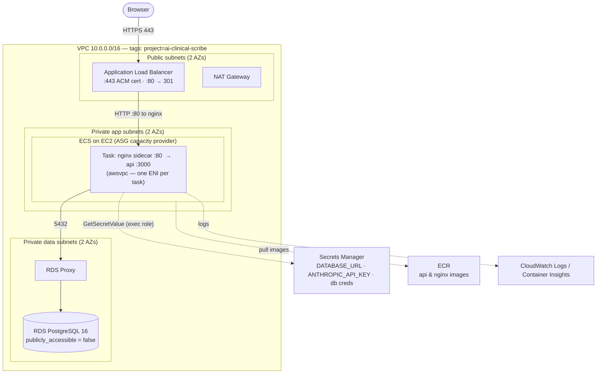
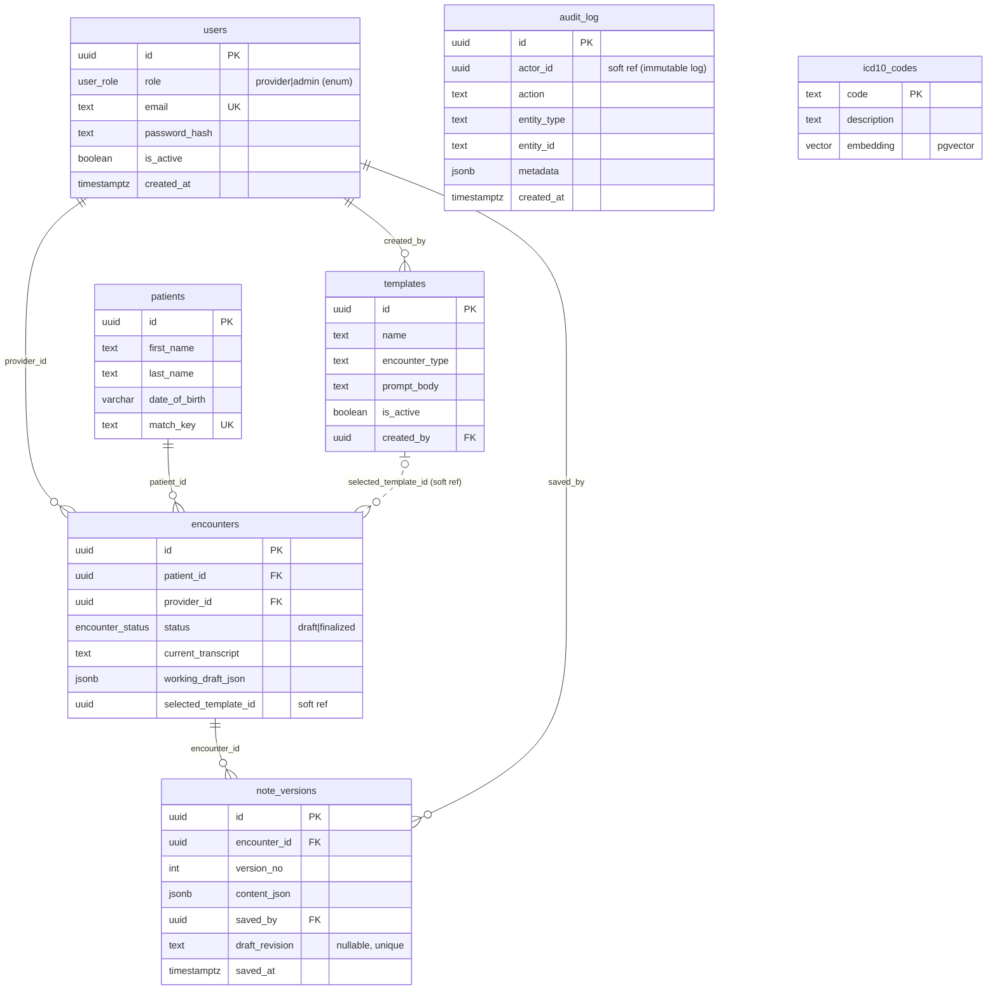

# AI Clinical Scribe — AWS Deployment Plan

**Author:** Infra / DevOps
**Status:** Plan for review (no resources provisioned yet)
**Audience:** the security walkthrough in the code-review video — every choice below is written to be defensible in two minutes on a screen-share.

This document does three things: (1) lays out **all viable deployment options** with tradeoffs, (2) commits to a **recommended target architecture** — ECS-on-EC2 behind an ALB with an ACM certificate, provisioned with Terraform — and (3) maps **every hard rubric requirement** to the exact mechanism that satisfies it and how to demonstrate it live.

The recommendation is deliberately not the flashiest option. It is the one that satisfies the literal rubric (runs on EC2, nginx reverse proxy, valid CA cert, private RDS, Secrets Manager, real pooling) while giving a genuine container-orchestration story to walk through — without the control-plane weight of EKS on a next-day deadline.

---

## 0. TL;DR recommendation

| Concern | Decision |
|---|---|
| IaC | **Terraform**, remote state in S3 + DynamoDB lock. State is never committed. |
| Compute | **ECS on EC2** (Amazon ECS, EC2 capacity provider backed by an ASG). Satisfies "hosted on EC2" literally, gives orchestration (health, rolling deploy, self-heal). |
| Ingress / TLS | **ALB** in public subnets, **HTTPS:443 with an ACM cert**, HTTP:80 → 301 redirect. ACM auto-renews; no cert files to manage. |
| Reverse proxy | **nginx as a sidecar container** in the app task. ALB → nginx:80 → app:3000 over task-local loopback. The Node process is never bound to 80/443. |
| Database | **RDS PostgreSQL 16**, private subnets, `publicly_accessible = false`, ingress only from the app security group. pgvector + pgcrypto enabled. |
| Pooling | App keeps its bounded TypeORM pool (`poolSize: 10`, one pool per process). **RDS Proxy** in front for connection multiplexing and clean failover. |
| Secrets | **AWS Secrets Manager**, injected into the container via the ECS task definition `secrets` block (`valueFrom` an ARN). Zero secrets in the repo, image, or committed state. |
| DNS | Route 53 hosted zone; `A/ALIAS` → ALB. Needed for both ACM DNS-validation and a real HTTPS hostname. |

Lower-effort fallback if the deadline tightens: collapse to a **single EC2 + Docker Compose** box with the same ALB+ACM front and private RDS. Section 3.2 covers this trade explicitly.

---

## 1. How to read this against the rubric

The infra rubric is scored pass/fail on seven hard requirements. They are the spine of this plan:

1. Hosted on AWS EC2, reachable over HTTPS with a **valid (non-self-signed) certificate**.
2. All persistent data in **RDS** (Postgres/MySQL) — nothing that must survive a restart lives on the box.
3. **Normalized, defensible schema** — walk the ERD live.
4. **Connection pooling** done correctly — no connection-per-request.
5. **All secrets in Secrets Manager / Parameter Store** — nothing hardcoded, nothing in a committed `.env`, nothing in committed Terraform state.
6. **nginx reverse proxy** in front — the app process is never directly on 80/443.
7. **RDS not publicly accessible** — VPC-only, ingress restricted to the app's security group.

Section 6 is the requirement-by-requirement compliance matrix; sections 4–11 are the design that backs it.

---

## 2. What the application already gives us

Grounding the infra in the code that exists (so the walkthrough is honest):

- **NestJS API** (`backend/`) on port 3000, containerized (multi-stage `Dockerfile`, `production` target runs `node dist/main`).
- **React SPA** (`frontend/`) built to static assets, served by nginx (`frontend/nginx.conf` already reverse-proxies `/api/` → the API and disables buffering for SSE streaming).
- **Secrets abstraction already exists** — `src/secrets/secrets-provider.port.ts` defines `SecretsProvider.get(key)`; today only `EnvSecretsProvider` (reads `process.env`) is wired. This is the seam where Secrets Manager plugs in (Section 8).
- **Pooling already exists** — `src/database/database.module.ts` builds one TypeORM `DataSource` with `poolSize: 10`, `synchronize: false`, and runs migrations on init. One pool per process, reused across requests. Requirement 4 is already true in code; infra just has to not break it (Section 7.3).
- **Migrations are explicit** — nine TypeORM migrations under `src/database/migrations/` (pgcrypto → users → patients → encounters → note_versions → draft_revision → audit_log → icd10_codes → templates). The schema is real and versioned, which is what makes the ERD defensible.
- **pgvector** — ICD-10 semantic search needs the `vector` extension; **pgcrypto** provides `gen_random_uuid()`. Both are available on RDS PostgreSQL and enabled by migration.

Two consequences worth flagging up front: the app **runs migrations on boot**, which needs care when more than one task starts at once (Section 7.4), and the app reads config from `process.env`, which means ECS-native secret injection needs **no code change** (Section 8.2).

---

## 3. Options analysis ("all the options a DevOps engineer would weigh")

### 3.1 Infrastructure-as-Code

| Option | Fit | Notes |
|---|---|---|
| **Terraform** ✅ | **Chosen** | Cloud-agnostic, huge module ecosystem, plan/apply diff is easy to screen-share. Matches `infra/CLAUDE.md`. State needs deliberate handling (S3+DynamoDB). |
| AWS CDK | Good | Real TypeScript (matches the team's stack), but synthesizes CloudFormation — slower feedback, stack drift harder to reason about live. |
| CloudFormation / SAM | OK | Native, no state to manage, but verbose YAML and clumsy for VPC+ECS+RDS in one readable pass. |
| Pulumi | Good | Same language story as CDK; smaller ecosystem, another SaaS/state backend to explain. |
| Ansible / bash + `aws` CLI | Fallback | `infra/CLAUDE.md` explicitly allows hand-run CLI for the instance *only* if VPC/RDS/SG are still scripted. Not reproducible enough to be the primary. |

**Why Terraform:** the diff is the demo. `terraform plan` in the walkthrough shows exactly what exists and why, and the codebase doubles as the security documentation. (Your `infra/.claude/commands/tf-plan.md` is already set up for this.)

### 3.2 Compute topology

| Option | Meets "on EC2"? | Effort | Verdict |
|---|---|---|---|
| Single EC2 + Docker Compose | Yes | Lowest | **Fallback.** nginx + app + (optionally) a local pool all on one box; Elastic IP; systemd unit. Simplest to defend, but no orchestration story, single point of failure, deploys are `pull + up`. |
| ASG + ALB, raw EC2 (no orchestrator) | Yes | Medium | Self-healing and rolling via instance refresh, but you hand-roll deploy/health on each box. More ops than ECS for less capability. |
| **ECS on EC2** ✅ | **Yes (tasks run on EC2)** | Medium | **Chosen.** Real orchestration — task health, rolling deploys, placement, autoscaling — while container instances are literally EC2. nginx ships as a sidecar. |
| ECS Fargate | **No (serverless)** | Low | Cleanest ops, but Fargate is *not* EC2. Reading the rubric literally ("hosted on AWS EC2"), this is a risk. Mention as the "if EC2 weren't mandated" answer. |
| **EKS on EC2** | Yes | Highest | Strongest scaling/portability, but control-plane cost (~$73/mo), more moving parts (LB Controller, IRSA, External Secrets), and more to explain under a deadline. Full design in Appendix A. |

**Why ECS-on-EC2 over EKS:** identical rubric compliance, a fraction of the surface area. EKS earns its complexity at multi-team / multi-service scale; a single API + SPA does not need a Kubernetes control plane to be production-grade. I can defend that tradeoff directly — which is the point.

### 3.3 TLS / certificate

| Option | Valid CA cert | Renewal | Notes |
|---|---|---|---|
| **ALB + ACM** ✅ | Yes (Amazon CA) | **Automatic** | **Chosen.** Free public cert, DNS-validated via Route 53, ALB terminates TLS. Nothing to rotate on the box. |
| CloudFront + ACM (+ ALB origin) | Yes | Automatic | Adds a CDN/edge + WAF story and caches the SPA globally. Nice-to-have; extra layer to explain. Note ACM for CloudFront must live in `us-east-1`. |
| nginx + Let's Encrypt (Certbot) on EC2 | Yes | Auto (certbot timer) | Matches "nginx" most literally and needs no ALB, but you own renewal and it's awkward across >1 instance. Better fit for the single-EC2 fallback. |
| Self-signed | **No** | — | **Automatic fail.** Listed only to be explicit. |

**Why ALB+ACM:** it removes certificate lifecycle from the things that can page you, and TLS termination at the ALB with a redirect listener is a two-minute walkthrough. nginx still exists (as the app's reverse proxy behind the ALB), so requirement 6 is satisfied independently of where TLS terminates.

### 3.4 Secrets delivery

| Option | Fit | Notes |
|---|---|---|
| **Secrets Manager + ECS task-def injection** ✅ | **Chosen** | `secrets: [{ name: DATABASE_URL, valueFrom: <arn> }]`. ECS agent fetches at container start via the **execution role**; value lands in the process env, never in the image or repo. Supports rotation. |
| SSM Parameter Store (SecureString) | Good | Cheaper (free standard tier), same task-def injection path. Use for non-rotating config; fine if cost matters. Rubric explicitly allows it. |
| App-native SDK (`AwsSecretsManagerProvider`) | Good | Implement `SecretsProvider` with the AWS SDK, resolve at boot via the **task role**. Most portable (identical on EC2/EKS), keeps secrets out of the task-def entirely. One small class to add. |
| Instance user-data writes `.env` | Avoid | Secret ends up on disk. Only acceptable on tmpfs, 0600, root-owned — and still weaker than the above. |

**Recommendation:** task-def injection from Secrets Manager as the default (zero code change), and note the app-native provider as the more portable variant if you want secret resolution fully inside the app. RDS master credentials use **`manage_master_user_password`** so RDS creates and rotates them in Secrets Manager for you; the app connects as a **least-privilege application role**, not the master user.

### 3.5 Database connection management

| Option | When | Notes |
|---|---|---|
| App pool only (`poolSize` × replicas) | Small scale | Already implemented. Total server connections = `replicas × poolSize` + migration/admin headroom; keep under RDS `max_connections`. Perfectly defensible for the challenge. |
| **App pool + RDS Proxy** ✅ (recommended for the "production" answer) | Scaling / failover | Proxy multiplexes many client connections onto few DB connections, pins during transactions, and shortens failover. Lets you add tasks without exhausting `max_connections`. Small hourly cost. |
| PgBouncer sidecar | DIY alternative | Same idea as RDS Proxy, self-managed. More to run and explain; pick RDS Proxy unless cost forbids. |

---

## 4. Recommended target architecture



**Request path:** Browser → **ALB :443** (TLS terminated with the ACM cert) → **nginx :80** in the task → **API :3000** over the task's loopback. The SPA's static assets are served by that same nginx (mirroring today's `frontend/nginx.conf`), and `/api/` is proxied to the API with SSE buffering disabled so streamed SOAP tokens flush immediately. The API talks to **RDS Proxy :5432**, which fronts **RDS**. Nothing but the ALB is publicly reachable.

**Why each layer exists (walkthrough-ready):**
- **ALB** — public entry point + TLS termination + health checks. The only thing with a public IP.
- **nginx sidecar** — the app's reverse proxy (requirement 6). Serves the SPA, proxies `/api/`, and means the Node process only ever binds 3000 on loopback. Keeping it *in the task* (not a separate box) makes "app is never on 80/443" trivially true and co-locates it with the API.
- **ECS/EC2 in private subnets** — no public IPs on the workload; egress (image pulls, Secrets Manager, Anthropic API) via NAT.
- **RDS Proxy + RDS** in isolated data subnets — reachable only from the app SG.

---

## 5. Network & security-group design

**Subnets (2 AZs for the ALB's and RDS's HA requirements):**

| Tier | Route to internet | Holds |
|---|---|---|
| Public (2) | IGW | ALB, NAT Gateway |
| Private-app (2) | NAT (egress only) | ECS EC2 instances / tasks |
| Private-data (2) | none | RDS, RDS Proxy |

**Security groups — every rule carries a one-line reason (per `infra/CLAUDE.md`):**

| SG | Ingress | Egress | Justification |
|---|---|---|---|
| `alb-sg` | 443 from `0.0.0.0/0`; 80 from `0.0.0.0/0` (redirect only) | to `app-sg:80` | Public HTTPS is the only allowed wildcard ingress. |
| `app-sg` | 80 from `alb-sg` **only** | to `db-sg:5432`, 443 to NAT (image/secret/LLM egress) | App is reachable only via the ALB; talks out only to DB and required APIs. |
| `db-sg` | 5432 from `app-sg` (and `rdsproxy-sg`) **only** | none | **Requirement 7.** No CIDR ingress, no public path. |
| `rdsproxy-sg` | 5432 from `app-sg` | 5432 to `db-sg` | Proxy sits between app and RDS. |

No `0.0.0.0/0` ingress anywhere except 443 (and the 80→443 redirect) on `alb-sg`. RDS has `publicly_accessible = false`, lives only in private-data subnets (a subnet group with no IGW route), and its SG references the app SG by ID — not a CIDR. That triad (private subnet + no public flag + SG-by-reference) is what you show on screen for requirement 7.

---

## 6. Requirement-by-requirement compliance matrix

| # | Requirement | How this design satisfies it | How to demo live |
|---|---|---|---|
| 1 | EC2 + valid HTTPS cert | ECS **tasks run on EC2** instances; **ALB:443 uses an ACM cert** (Amazon public CA), HTTP→HTTPS redirect | `curl -vI https://<domain>` shows a valid chain; ACM console shows "Issued/Amazon"; EC2 console shows the container instances |
| 2 | All persistent data in RDS | encounters, note_versions, patients, users, templates, audit_log, icd10_codes all in **RDS Postgres**; containers are stateless; no EBS/host data | `\dt` on RDS; show no local volumes in the task def |
| 3 | Normalized, defensible schema | 3NF relational spine + explicit FKs + unique constraints; append-only versioning; JSONB only for the SOAP document body (Section 7.2) | Walk the ERD; show migrations + constraints |
| 4 | Correct pooling | One TypeORM pool per process (`poolSize: 10`), reused; **RDS Proxy** multiplexes; sized under `max_connections` | Show `database.module.ts`; `pg_stat_activity` count stays bounded under load |
| 5 | Secrets in Secrets Manager | Task-def `secrets.valueFrom` ARNs; execution role scoped to those ARNs + KMS; **grep the repo/image — nothing** | Show task def, IAM policy, and `git grep` coming up empty; show the secret in the console |
| 6 | nginx reverse proxy, app not on 80/443 | **nginx sidecar** fronts the API; Node binds **3000 on loopback**; ALB targets nginx | `ss -ltnp` in the task: 3000 only, no 80/443 on the app; show nginx config |
| 7 | RDS not public | Private-data subnets, `publicly_accessible=false`, `db-sg` ingress from `app-sg` only | Show the SG rules, subnet group, and a failed connect from outside the VPC |

---

## 7. Data layer

### 7.1 RDS configuration

- **Engine:** PostgreSQL 16 (matches local `pgvector/pgvector:pg16`; pgvector + pgcrypto both supported on RDS).
- **Instance:** start `db.t4g.small` (2 vCPU / 2 GiB) — burstable, cheap, enough headroom for the pool math below. Right-size later.
- **Storage:** gp3, `storage_encrypted = true` (KMS). PHI-shaped data is demo-only per repo rules, but encryption-at-rest is table stakes and a free talking point.
- **HA:** Multi-AZ is the production answer (automatic failover, and RDS Proxy shortens it). Single-AZ is an acceptable cost-saving for the graded demo — call it out as a conscious tradeoff, not an oversight.
- **Extensions:** `CREATE EXTENSION pgcrypto` (uuid generation) and `vector` (ICD-10 embeddings) — already handled by migration `1000000000000-EnablePgcrypto` and the icd10 migration. Confirm they're in `rds.allowed_extensions` (both are by default).
- **Backups:** automated backups + 7-day retention + deletion protection in prod; final snapshot on destroy.

### 7.2 ERD (from the actual migrations)



**Normalization defense (the ERD walkthrough script):**
- **3NF on the relational spine.** Every non-key attribute depends on the key. `role` and `status` are Postgres enums, not free text. Surrogate UUID PKs; natural keys enforced by unique constraints (`users.email`, `patients.match_key`, `note_versions (encounter_id, version_no)`).
- **Providers and admins share `users`** distinguished by `role` — single-table inheritance is correct here because they share every attribute and differ only by permission. No nullable role-specific columns, so no 3NF violation.
- **Append-only version history.** `note_versions` is immutable; `UNIQUE (encounter_id, version_no)` guarantees a clean, gap-checked lineage, and `draft_revision` (partial-unique) makes draft saves **idempotent** — a retried save can't create a duplicate version. This is the audit story for clinical edits.
- **JSONB is deliberate, not lazy.** `working_draft_json` / `content_json` hold the **SOAP note document** (Subjective/Objective/Assessment/Plan). That's a cohesive aggregate validated by `packages/contracts`, not data you query relationally across notes — so it's stored as a document and the *relational* keys around it stay normalized. I can articulate exactly where the relational/document boundary is and why.
- **Soft references are a choice.** `audit_log.actor_id` has **no FK** on purpose — the audit trail must survive user deletion and never fail a write because of a join constraint. `encounters.selected_template_id` is a nullable soft ref so deleting a template doesn't cascade into encounter history. Both are defensible; I'll name them before the reviewer does.

### 7.3 Connection-pool sizing

Postgres `max_connections` on RDS ≈ `LEAST(DBInstanceClassMemory / 9531392, 5000)` — roughly **~110** on a 1 GiB class, **~225** on 2 GiB (`db.t4g.small`). Budget:

```
total app connections = ecs_desired_count × poolSize (10)
                      + migration task headroom
                      + admin/monitoring headroom
```

At 2 tasks that's `2 × 10 = 20` — a rounding error under 225. The point for requirement 4 isn't the number, it's that it's **bounded and reused**: one pool per process, no per-request `new DataSource()`. With **RDS Proxy**, even a task-count spike can't exhaust the server because the proxy caps and multiplexes backend connections. Set the Proxy `MaxConnectionsPercent` conservatively and keep `poolSize × maxTasks` under it.

### 7.4 Migrations under orchestration (the one real gotcha)

`DatabaseModule` calls `ds.runMigrations()` on boot. With N tasks starting together, N runners race. TypeORM wraps each migration in a transaction and records it in the `migrations` table, so after the first winner the rest mostly no-op — but "mostly" isn't defensible. Two fixes, in order of preference:

1. **One-shot migration task.** Run `migrations` as a separate ECS `RunTask` (same image, command overridden to a migrate-only entrypoint) in the deploy pipeline **before** the service rolls. Gate the service containers with `RUN_MIGRATIONS=false` so only the one-shot task migrates. Clean, observable, ordered.
2. **Postgres advisory lock.** Wrap `runMigrations()` in `pg_advisory_lock(<const>)` so concurrent runners serialize and late ones find nothing to do. Good belt-and-suspenders even with option 1.

I'd ship option 1 and mention option 2 as the safety net.

---

## 8. Secrets flow (detailed)

### 8.1 What's stored where

| Secret | Store | Consumer | Rotation |
|---|---|---|---|
| RDS master creds | Secrets Manager (`manage_master_user_password`) | admin/break-glass only | RDS-managed |
| App DB URL (`DATABASE_URL`, least-priv role) | Secrets Manager | API task | manual/rotatable |
| `ANTHROPIC_API_KEY` | Secrets Manager | API task | manual |
| `JWT_SECRET` | Secrets Manager (or SSM SecureString) | API task | manual |

### 8.2 Injection path (no code change)

The task definition maps each env var to a secret ARN:

```jsonc
"secrets": [
  { "name": "DATABASE_URL",      "valueFrom": "arn:aws:secretsmanager:...:secret:acs/database_url" },
  { "name": "ANTHROPIC_API_KEY", "valueFrom": "arn:aws:secretsmanager:...:secret:acs/anthropic_api_key" },
  { "name": "JWT_SECRET",        "valueFrom": "arn:aws:secretsmanager:...:secret:acs/jwt_secret" }
]
```

At container start the ECS agent (via the **execution role**) fetches these and injects them as env vars. `EnvSecretsProvider.get('DATABASE_URL')` then reads them exactly as it does today — so requirement 5 is met with **zero application change**. The values exist only in Secrets Manager and in the container's process memory; never in the image, the repo, or Terraform state.

**Optional, more portable:** implement `AwsSecretsManagerProvider implements SecretsProvider` (AWS SDK, resolves at boot via the **task role**) and swap it into `SecretsModule`. Then secrets aren't even in the task def. Identical behaviour on EC2/EKS. One small class — noted as the upgrade path.

### 8.3 IAM scoping (least privilege)

- **Execution role:** `secretsmanager:GetSecretValue` on exactly the three app secret ARNs + `kms:Decrypt` on their CMK; plus ECR pull + CloudWatch Logs. Nothing else.
- **Task role:** only what the app calls at runtime (e.g. Secrets Manager if using the app-native provider; otherwise minimal). **Never** `AdministratorAccess` on an instance/task role — called out in `infra/CLAUDE.md`.
- **Terraform state** holds secret values and therefore lives in an encrypted, access-restricted S3 bucket with a DynamoDB lock — **never** git. `rotate-secret` and `sg-audit` runbooks already exist under `infra/.claude/commands/`.

---

## 9. Reverse proxy (requirement 6, precisely)

nginx runs as a **sidecar container** in the app task, reusing today's `frontend/nginx.conf` shape:
- `listen 80;` inside the task; serves the built SPA from `/usr/share/nginx/html`; `try_files … /index.html` for the React Router SPA fallback.
- `location /api/ { proxy_pass http://127.0.0.1:3000/api/; proxy_buffering off; proxy_cache off; }` — SSE tokens flush immediately (this matters for the streaming SOAP UX).
- The **ALB target group points at the nginx container port (80)**; the **API container publishes only 3000 on task loopback** and is never a target. `ss -ltnp` inside the task is the proof: 3000 on the API, 80 on nginx, nothing else.

TLS terminates at the ALB (ACM), so nginx speaks plain HTTP *inside* the VPC behind the ALB — the app is still never bound to 80/443, and the public edge is still HTTPS-only. If a reviewer wants TLS all the way to nginx, that's a config toggle (ALB→nginx:443 with an internal cert), but it isn't required and adds cert management inside the box.

---

## 10. Terraform layout & key resources

```
infra/
├── DEPLOYMENT_PLAN.md          # this file
├── deploy/                     # nginx.conf, task entrypoints, migrate script (source of truth for what runs)
├── envs/
│   └── prod/
│       ├── main.tf             # wires modules together
│       ├── backend.tf          # S3 + DynamoDB remote state
│       ├── variables.tf
│       ├── outputs.tf          # alb_dns_name, rds_endpoint (no secrets)
│       └── terraform.tfvars    # non-secret vars only (gitignored if any doubt)
└── modules/
    ├── network/                # VPC, 6 subnets, IGW, NAT, route tables
    ├── security/               # alb-sg, app-sg, db-sg, rdsproxy-sg (commented rules)
    ├── data/                   # RDS, subnet group, RDS Proxy, parameter group
    ├── secrets/                # Secrets Manager entries (values via TF_VAR / -var-file, not literals)
    ├── compute/                # ECS cluster, capacity provider, ASG+LT, task def, service, autoscaling
    ├── edge/                   # ALB, target group, 443 listener (ACM), 80→443 redirect
    ├── dns/                    # Route 53 zone/records, ACM cert + DNS validation
    └── iam/                    # execution role, task role, instance role (least priv)
```

**Remote state (do this first):**

```hcl
# envs/prod/backend.tf
terraform {
  backend "s3" {
    bucket         = "acs-tfstate-<acct>"
    key            = "prod/terraform.tfstate"
    region         = "us-east-1"
    dynamodb_table = "acs-tflock"
    encrypt        = true
  }
}
```

**ACM cert (DNS-validated) — the "valid cert" primitive:**

```hcl
resource "aws_acm_certificate" "app" {
  domain_name       = var.domain_name          # e.g. scribe.example.com
  validation_method = "DNS"
  lifecycle { create_before_destroy = true }
}
# aws_route53_record for the validation CNAME + aws_acm_certificate_validation …
```

**ALB listeners — HTTPS + redirect:**

```hcl
resource "aws_lb_listener" "https" {
  load_balancer_arn = aws_lb.app.arn
  port              = 443
  protocol          = "HTTPS"
  ssl_policy        = "ELBSecurityPolicy-TLS13-1-2-2021-06"
  certificate_arn   = aws_acm_certificate_validation.app.certificate_arn
  default_action { type = "forward"; target_group_arn = aws_lb_target_group.nginx.arn }
}
resource "aws_lb_listener" "http_redirect" {
  load_balancer_arn = aws_lb.app.arn
  port              = 80
  protocol          = "HTTP"
  default_action {
    type = "redirect"
    redirect { port = "443"; protocol = "HTTPS"; status_code = "HTTP_301" }
  }
}
```

**RDS — private, the requirement-7 primitive:**

```hcl
resource "aws_db_instance" "app" {
  engine                      = "postgres"
  engine_version              = "16"
  instance_class              = "db.t4g.small"
  db_subnet_group_name        = aws_db_subnet_group.private.name   # private-data subnets only
  vpc_security_group_ids      = [aws_security_group.db.id]         # ingress from app-sg only
  publicly_accessible         = false                             # ← requirement 7
  storage_encrypted           = true
  manage_master_user_password = true                              # RDS-managed creds in Secrets Manager
  multi_az                    = var.multi_az                      # true in prod
  backup_retention_period     = 7
  deletion_protection         = var.prod
  skip_final_snapshot         = !var.prod
}
```

**DB security group — SG-by-reference, no CIDR:**

```hcl
resource "aws_security_group_rule" "db_from_app" {
  type                     = "ingress"
  from_port                = 5432
  to_port                  = 5432
  protocol                 = "tcp"
  security_group_id        = aws_security_group.db.id
  source_security_group_id = aws_security_group.app.id   # only the app tier, by SG id
  description              = "Postgres from app tier only — no public path"
}
```

**ECS service + task (nginx sidecar + secrets):** `awsvpc` network mode; two container defs (`nginx` :80, `api` :3000); `secrets[]` from Section 8.2; target group → nginx:80; `deployment_circuit_breaker { enable = true, rollback = true }`; service autoscaling on CPU/ALB request count. Full module in `modules/compute`.

---

## 11. Deploy runbook (phased, deadline-friendly)

Cut from the bottom if time runs short; the top phases are the rubric.

1. **State & prereqs** — create the S3 state bucket + DynamoDB lock (one-time, out of band); pick a domain, create the Route 53 zone; put secret values in Secrets Manager (`aws secretsmanager create-secret …`, never in `.tf`).
2. **Network** — `terraform apply` the `network` + `security` modules; verify subnets/route tables (`sg-audit` runbook).
3. **Data** — apply `data`; confirm `publicly_accessible=false`, connect only from inside the VPC (bastion/SSM), enable extensions, run the **one-shot migration task**.
4. **Edge + DNS + TLS** — apply `dns` (ACM + validation) and `edge` (ALB, listeners); `tls-verify` runbook confirms a valid chain.
5. **Compute** — build & push `api` + `nginx` images to ECR; apply `compute`; the service registers healthy targets on nginx:80.
6. **Cutover & verify** — Route 53 `A/ALIAS` → ALB; walk the compliance matrix (Section 6) end to end; run `deploy-checklist`.
7. **Harden (optional)** — Multi-AZ RDS, RDS Proxy, WAF on the ALB, CloudFront, alarms.

**CI/CD (GitHub Actions or your Azure DevOps pipeline):** build image → push to ECR → `RunTask` migrations → `aws ecs update-service --force-new-deployment` → circuit breaker auto-rolls back on failed health. Deploys are image-tag swaps; infra changes go through `terraform plan` review (`tf-plan` runbook).

---

## 12. Observability, cost, teardown

- **Logs/metrics:** `awslogs` driver → CloudWatch per container; ECS **Container Insights**; ALB access logs to S3; RDS Enhanced Monitoring + Performance Insights. Alarms on ALB 5xx, target health, RDS CPU/connections/free storage.
- **Health:** ALB health check → nginx `/` (or an app `/health` behind it); ECS uses it for rolling deploys and self-heal.
- **Cost (rough, us-east-1, single-AZ demo):** ALB ~$16–20/mo + LCUs; 1× `t3.small`/`t4g.small` ECS instance ~$15/mo; `db.t4g.small` single-AZ ~$25/mo; NAT ~$32/mo + data; RDS Proxy ~$12–15/mo; Secrets Manager $0.40/secret. **≈ $100–120/mo**, dominated by NAT + ALB + RDS. EKS would add ~$73/mo control plane. Single-EC2 fallback (no ALB/NAT if using a public subnet + Let's Encrypt) drops it to ~$30–40/mo. `cost-estimate` runbook has the live math.
- **Teardown:** `terraform destroy` (deletion protection off in non-prod, final snapshot on prod). Everything is tagged `project=ai-clinical-scribe` for sweep.

---

## Appendix A — EKS variant (if orchestration-on-Kubernetes is the ask)

Same VPC/RDS/Secrets/ALB story; swap the compute tier:

- **Cluster:** EKS control plane + a managed node group (EC2) in the private-app subnets. (~$73/mo control plane is the headline cost delta.)
- **Ingress/TLS:** **AWS Load Balancer Controller** provisions an ALB from an `Ingress`; `alb.ingress.kubernetes.io/certificate-arn` attaches the **ACM** cert; `ssl-redirect` annotation does 80→443. Same valid-cert story.
- **Reverse proxy:** either the **ingress-nginx** controller or an **nginx sidecar** in the pod. App container listens on 3000; Service/targetPort points at nginx. Requirement 6 holds.
- **Secrets:** **Secrets Store CSI driver** + AWS provider (mounts Secrets Manager as files/env), or **External Secrets Operator** syncing to Kubernetes Secrets — both via **IRSA** (per-service-account IAM, least privilege). No secrets in manifests.
- **DB:** identical — private RDS + RDS Proxy, SG from the node/pod SG.
- **Migrations:** a Kubernetes **Job** (or Helm pre-install/pre-upgrade hook) instead of an ECS one-shot task.
- **IaC:** Terraform for the cluster + `terraform-aws-eks`; app manifests via Helm/Kustomize.

**When to actually choose EKS:** multiple teams/services, existing Kubernetes expertise, portability across clouds, or advanced scheduling. For one API + SPA on a deadline, it's more control plane than the problem needs — which is exactly the tradeoff to state out loud.

---

## Appendix B — Single-EC2 fallback (cheapest, most literal "nginx")

One EC2 in a public subnet with an Elastic IP: **nginx** (system package) terminates TLS with a **Let's Encrypt** cert (certbot timer auto-renews) and reverse-proxies to the app container on 3000; **Docker Compose** runs the app; **RDS stays private** (app SG → db SG); secrets pulled at boot from Secrets Manager by a systemd `ExecStartPre` into a tmpfs env file (0600, root). `infra/deploy/` holds the nginx conf, systemd unit, and deploy script. Satisfies all seven requirements with the least infrastructure; loses orchestration, HA, and zero-downtime deploys. Keep this in your back pocket if the ECS build runs long before the Saturday 3PM deadline.

---

## Open decisions before build

- **Domain:** which hostname / Route 53 zone? (Required for ACM validation and a real HTTPS URL.)
- **Multi-AZ RDS + RDS Proxy:** on for the "production" defense, or off to save ~$40/mo for the graded demo?
- **Secrets:** task-def injection (zero code) vs the app-native `AwsSecretsManagerProvider` (more portable)?
- **Migrations:** ship the one-shot migration task now, or advisory-lock the boot path for the demo and harden later?
